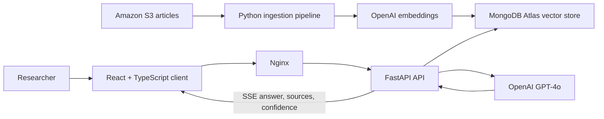

<p align="center">
  
</p>

# Quill & Query

**A source-grounded editorial research workspace.**

> [!IMPORTANT]
> **Project status: Decommissioned.** Quill & Query is preserved as a portfolio
> project. Its hosted application and cloud infrastructure have been retired;
> there is no live demo. The source remains available for architectural review
> and local experimentation with user-provided services and credentials.

Quill & Query turns a curated article collection into a conversational research
workspace. A Python ingestion pipeline reads articles from Amazon S3, splits
them into overlapping passages, creates OpenAI embeddings, and stores the
result in MongoDB Atlas. The application retrieves the passages most relevant
to a question and asks GPT-4o to answer from that context, returning the source
articles and a retrieval-similarity indicator with the response.

The project began as a Streamlit prototype and evolved into a containerized
React and FastAPI application with streaming responses, persistent research
sessions, project organization, and a searchable view of the indexed corpus.

## What it demonstrates

- End-to-end retrieval-augmented generation, from object storage and chunking
  through vector retrieval and grounded answer generation.
- Context-aware follow-up questions by rewriting conversational prompts into
  standalone retrieval queries.
- Token-level Server-Sent Events (SSE), followed by sources, retrieval
  confidence, and generated follow-up suggestions.
- Persistent conversations and project organization backed by indexed MongoDB
  collections.
- A searchable, paginated article-metadata layer kept separate from the larger
  vectorized passage collection.
- Application hardening with JWT authentication, bcrypt password verification,
  rate limiting, bounded request models, an explicit CORS allowlist, and Nginx
  security headers.
- A production-oriented migration from a rapid Streamlit prototype to a
  separated React frontend and FastAPI API.

## Architecture



The current Docker Compose topology builds two services:

- `frontend` compiles the React application and serves it through Nginx. Nginx
  also proxies `/api/` and disables buffering for streamed responses.
- `backend` runs FastAPI with the RAG pipeline mounted from `src/` and shares a
  single MongoDB client and connection pool across routes.

OpenAI, MongoDB Atlas, and Amazon S3 remain external managed services and are
not included in the Compose environment.

## How a question is answered

1. For a conversational follow-up, GPT-4o mini rewrites the prompt as a
   standalone retrieval query using the latest three exchanges.
2. `text-embedding-3-small` embeds the query.
3. MongoDB Atlas Vector Search returns the four most similar passages from a
   50-candidate search.
4. FastAPI sends those passages, recent conversation history, and previously
   cited source names to GPT-4o with an instruction to use only the supplied
   context.
5. The API streams answer tokens to the browser over SSE.
6. Sources and the mean vector-similarity score are delivered as soon as the
   answer completes; three suggested follow-up questions arrive in a separate
   event.
7. The complete exchange, sources, and similarity score are persisted to the
   conversation record in MongoDB.

The displayed confidence percentage is derived from retrieval similarity. It
is useful as an interface cue, but it is **not** a calibrated probability that
an answer is factually correct.

## Evolution

The first version used Streamlit to validate the ingestion, retrieval, source
display, and conversational workflow quickly. As the feature set expanded, the
application was split into clearer boundaries:

- React and TypeScript own routing, authentication state, streaming UI, chat
  presentation, project navigation, and article discovery.
- FastAPI owns authentication, request validation, chat orchestration, and CRUD
  routes for conversations, projects, and article metadata.
- `src/` owns ingestion and retrieval logic.
- MongoDB collections separate vectorized passages, article metadata,
  conversations, and projects.

The Streamlit prototype has been removed; it remains available in the
repository's Git history. The current two-service application is defined by
`frontend/Dockerfile`, `backend/Dockerfile`, and `docker-compose.yml`.

## Security and reliability

The final iteration added several controls appropriate to the application's
single-user hosted model:

- Passwords are verified against a bcrypt hash; the API returns a time-limited
  HS256 JWT rather than storing the password in the client.
- Login attempts are limited to 10 per minute.
- Chat input and history sizes are bounded with Pydantic models.
- JWT secrets are required at startup rather than falling back to a default.
- CORS is limited to the documented local frontend origins.
- A shared MongoDB client avoids duplicate connection pools, and idempotent
  indexes support the application's primary lookup and sort paths.
- Nginx adds framing, MIME-sniffing, referrer, and legacy XSS headers.
- Answer prompts require the model to stay within retrieved context and admit
  when that context does not contain an answer.

These controls reduce risk; they do not turn the repository into a supported
multi-user production service. The hosted instance has been decommissioned.

## Local setup

### Prerequisites

- Docker with Docker Compose
- An OpenAI API key
- A MongoDB Atlas deployment with Vector Search
- An Amazon S3 bucket containing UTF-8 article files under `articles/`
- AWS credentials with read access to that bucket

### 1. Configure the environment

```bash
git clone https://github.com/t-shahan/quill-and-query.git
cd quill-and-query
cp .env.example .env
```

Fill in `.env` with your own service credentials. Generate a JWT signing secret
with:

```bash
openssl rand -hex 32
```

Generate `APP_PASSWORD_HASH` after installing the backend dependencies in a
local virtual environment:

```bash
python3 -m venv .venv
source .venv/bin/activate
pip install -r backend/requirements.txt
python -c "from passlib.context import CryptContext; print(CryptContext(schemes=['bcrypt']).hash('replace-this-password'))"
```

Store only the resulting hash in `.env`; do not commit `.env`.

### 2. Prepare the article index

Install the ingestion dependencies if the virtual environment does not already
have them:

```bash
pip install -r requirements.txt
```

`src/generate_articles.py` carries a small demonstration corpus inline and
uploads it to S3. Run it, then chunk, embed, and store the articles in MongoDB:

```bash
python src/generate_articles.py
python src/embed_articles.py
```

The backend creates its own MongoDB indexes at startup, so no separate indexing
step is required.

In MongoDB Atlas, create a Vector Search index named `vector_index` for the
`articles` collection:

```json
{
  "fields": [
    {
      "type": "vector",
      "path": "embedding",
      "numDimensions": 1536,
      "similarity": "cosine"
    }
  ]
}
```

### 3. Run the current application

```bash
docker compose up --build
```

Open `http://localhost:3000`. The frontend proxies API requests through Nginx
to the FastAPI service. The API health endpoint is available at
`http://localhost:3000/api/health`.

## Repository layout

```text
frontend/   React, TypeScript, Tailwind CSS, Vite, and Nginx
backend/    FastAPI routes, authentication, rate limiting, and MongoDB access
src/        Article generation, ingestion, embedding, retrieval, and RAG logic
scripts/    Retired AWS deployment examples
```

## Deployment history

The application was formerly hosted on Amazon EC2 as separate frontend and
backend containers managed with Docker Compose. Nginx served the compiled React
application, proxied API requests, and forwarded SSE responses without
buffering. A least-privilege Lambda function and EventBridge rules started and
stopped the instance on a schedule.

That infrastructure no longer exists. The sanitized scripts in `scripts/` are
retained as architecture examples and require explicit operator configuration;
they are not a supported deployment system.

## Known limitations

- There is no hosted demo, active deployment, or ongoing operational support.
- Running the complete system requires paid or account-backed external services.
- The included corpus is generated sample content, not a production editorial
  dataset.
- The MongoDB Atlas Vector Search index must be created outside the application.
- Retrieval uses a fixed top-four result set without reranking or formal answer
  evaluation.
- The confidence indicator reflects average vector similarity, not factual
  certainty.
- The repository does not include an automated test suite or CI workflow.
- JWTs are kept in browser local storage, which is appropriate only for this
  constrained portfolio application—not a general multi-user security model.

## Tech stack

- **Frontend:** React 19, TypeScript, Vite, Tailwind CSS, Axios, React Router,
  React Markdown
- **Backend:** Python, FastAPI, Pydantic, Uvicorn, SlowAPI, python-jose,
  Passlib/bcrypt
- **Retrieval and AI:** OpenAI GPT-4o, GPT-4o mini,
  `text-embedding-3-small`, LangChain text splitters, MongoDB Atlas Vector Search
- **Storage and infrastructure:** Amazon S3, MongoDB Atlas, Docker Compose,
  Nginx, Amazon EC2, AWS Lambda, EventBridge

## License

Released under the [MIT License](LICENSE).
