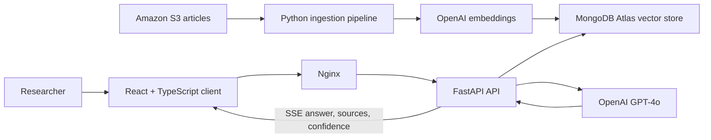

# Quill & Query Public Release Implementation Plan

> **For agentic workers:** REQUIRED SUB-SKILL: Use superpowers:subagent-driven-development (recommended) or superpowers:executing-plans to implement this plan task-by-task. Steps use checkbox (`- [ ]`) syntax for tracking.

**Goal:** Prepare and rename the private repository for a later public portfolio release as Quill & Query, push the reviewed commits, and leave the final visibility change to the owner.

**Architecture:** Preserve the existing React/FastAPI application and legacy Streamlit prototype. Apply a consistent public-facing identity, add archive-first documentation and MIT licensing, replace deployment-specific identifiers with operator configuration, and verify the static/build surfaces without calling external services.

**Tech Stack:** Python 3.11+, FastAPI, React 19, TypeScript 5.9, Vite 8, Tailwind CSS 4, MongoDB Atlas, OpenAI APIs, Amazon S3, Docker Compose, Nginx, Bash

## Global Constraints

- Product name is `Quill & Query`; proposed repository slug is `quill-and-query`.
- Descriptor is `Source-grounded editorial research workspace`.
- State above the README fold that the hosted application and cloud infrastructure are decommissioned and that there is no live demo.
- Preserve all existing Git history; do not squash, rewrite, or remove historical commits.
- Rename the private GitHub repository to `quill-and-query` and push only after all local verification gates pass.
- Do not change GitHub visibility, make the repository public, deploy, or provision cloud resources.
- Add the MIT License with Taylor Shahan as copyright holder.
- Never read values from `.env` into generated documentation or command output.
- Do not claim automated tests or CI.
- Retain technically accurate internal RAG names unless they confuse public readers.

## File Map

- `frontend/index.html`: browser title.
- `frontend/src/pages/ChatPage.tsx`: current-app empty-state title.
- `frontend/src/components/Auth/LoginForm.tsx`: login title.
- `frontend/src/components/Layout/BrandingHeader.tsx`: sidebar product mark.
- `frontend/src/api/client.ts`: browser token-storage key.
- `frontend/package.json`, `frontend/package-lock.json`: frontend package identity.
- `backend/main.py`: FastAPI display title.
- `app/dashboard.py`: retained Streamlit prototype display title.
- `.env.example`: documented configuration keys with safe example values.
- `scripts/deploy.sh`: generic, operator-configured historical deployment helper.
- `scripts/ec2-scheduler-setup.sh`: generic daily start/stop infrastructure example with no termination rule.
- `README.md`: primary public portfolio documentation.
- `LICENSE`: MIT License.
- `frontend/README.md`: remove the generic Vite template documentation.

---

### Task 1: Apply the Quill & Query Identity

**Files:**
- Modify: `frontend/index.html:7`
- Modify: `frontend/src/pages/ChatPage.tsx:42`
- Modify: `frontend/src/components/Auth/LoginForm.tsx:31`
- Modify: `frontend/src/components/Layout/BrandingHeader.tsx:149-154`
- Modify: `frontend/src/api/client.ts:13`
- Modify: `frontend/package.json:2`
- Modify: `frontend/package-lock.json:2-8`
- Modify: `backend/main.py:28`
- Modify: `app/dashboard.py:70,101,135`

**Interfaces:**
- Consumes: existing React UI, FastAPI metadata, Streamlit prototype, and browser local-storage behavior.
- Produces: consistent visible product naming and the browser storage key `quill_query_token`.

- [ ] **Step 1: Record the pre-change naming failures**

Run:

```bash
rg -n "RAG Article App|<title>Prototype</title>|^[[:space:]]*Prototype$|rag_token" frontend backend app
```

Expected: matches in the browser title, React UI, Streamlit UI, FastAPI title, sidebar header, and token key.

- [ ] **Step 2: Replace visible names and metadata**

Apply these exact values:

```text
Browser title: Quill & Query
React empty-state title: Quill & Query
React login title: Quill & Query
Sidebar product mark: Quill & Query
FastAPI title: Quill & Query API
Streamlit page and heading title: Quill & Query
Frontend package name: quill-and-query-frontend
Browser token key: quill_query_token
```

Keep the sidebar version label `v0.1`. Do not rename `rag_chain.py`, the default MongoDB database, or explanatory comments that use RAG as the technical pattern name.

- [ ] **Step 3: Synchronize the npm lockfile**

Run:

```bash
npm install --package-lock-only --ignore-scripts
```

Working directory: `frontend/`

Expected: `package-lock.json` records `quill-and-query-frontend` without installing or executing package scripts.

- [ ] **Step 4: Verify the naming change**

Run:

```bash
rg -n "RAG Article App|<title>Prototype</title>|^[[:space:]]*Prototype$|rag_token" frontend backend app
```

Expected: no matches.

Run:

```bash
rg -n "Quill & Query|quill-and-query-frontend|quill_query_token" frontend backend app
```

Expected: matches at every public-facing identity location listed above.

- [ ] **Step 5: Commit the identity update**

```bash
git add frontend/index.html frontend/src/pages/ChatPage.tsx frontend/src/components/Auth/LoginForm.tsx frontend/src/components/Layout/BrandingHeader.tsx frontend/src/api/client.ts frontend/package.json frontend/package-lock.json backend/main.py app/dashboard.py
git commit -m "feat: rebrand application as Quill and Query"
```

---

### Task 2: Sanitize Configuration and Historical Deployment Helpers

**Files:**
- Create: `.env.example`
- Modify: `scripts/deploy.sh`
- Modify: `scripts/ec2-scheduler-setup.sh`

**Interfaces:**
- Consumes: the existing environment-variable names used by Python services and the retired AWS deployment workflow.
- Produces: safe configuration documentation plus deployment helpers that require explicit operator input and contain no former endpoint.

- [ ] **Step 1: Record the pre-change safety failures**

Run:

```bash
rg -n "18[.]191[.]229[.]137|rag-app-key[.]pem|rag-article-app|terminate_instances|ec2:TerminateInstances|ec2-terminate-mar21|2026" scripts
```

Expected: matches in `scripts/deploy.sh` and `scripts/ec2-scheduler-setup.sh`.

- [ ] **Step 2: Add the safe environment template**

Create `.env.example` with exactly these keys and non-secret example values:

```dotenv
# OpenAI
OPENAI_API_KEY=

# MongoDB Atlas
MONGODB_URI=
MONGODB_DB=quill_query

# Amazon S3 article source
S3_BUCKET_NAME=
AWS_ACCESS_KEY_ID=
AWS_SECRET_ACCESS_KEY=
AWS_REGION=us-east-1

# Application authentication
JWT_SECRET_KEY=
APP_PASSWORD_HASH=
```

- [ ] **Step 3: Parameterize `scripts/deploy.sh`**

Use strict Bash mode and require operator-supplied `EC2_HOST` and `SSH_KEY_PATH`. Default only the remote checkout path:

```bash
#!/bin/bash
# Historical deployment helper for a self-managed EC2 host.
# Quill & Query is decommissioned; this script is retained for reference and
# requires explicit operator configuration.
set -euo pipefail

: "${EC2_HOST:?Set EC2_HOST to the SSH target, for example ubuntu@example-host}"
: "${SSH_KEY_PATH:?Set SSH_KEY_PATH to the private-key file}"
REMOTE_APP_DIR="${REMOTE_APP_DIR:-~/quill-and-query}"

ssh -i "$SSH_KEY_PATH" "$EC2_HOST" "
  set -e
  cd \"$REMOTE_APP_DIR\"
  git pull origin main
  docker compose down
  docker compose build --no-cache
  docker compose up -d
"
```

- [ ] **Step 4: Remove termination behavior from the scheduler**

Make these exact behavioral changes in `scripts/ec2-scheduler-setup.sh`:

```text
Header: describe daily start/stop scheduling only and state that infrastructure is decommissioned.
IAM actions: retain ec2:StartInstances and ec2:StopInstances; remove ec2:TerminateInstances.
Lambda handler: retain start and stop branches; remove the terminate branch.
EventBridge rules: create only ec2-daily-start and ec2-daily-stop.
Summary: list only start/stop schedules and resources.
```

Keep the instance-scoped IAM resource ARN and existing region argument. Do not run the script.

- [ ] **Step 5: Verify the sanitized scripts**

Run:

```bash
bash -n scripts/deploy.sh scripts/ec2-scheduler-setup.sh
```

Expected: exit code 0.

Run:

```bash
rg -n "18[.]191[.]229[.]137|rag-app-key[.]pem|rag-article-app|terminate_instances|ec2:TerminateInstances|ec2-terminate-mar21|2026" scripts
```

Expected: no matches.

Run:

```bash
env -u EC2_HOST -u SSH_KEY_PATH bash scripts/deploy.sh
```

Expected: nonzero exit with a message requiring `EC2_HOST`; no network connection is attempted.

- [ ] **Step 6: Commit the publication-safety update**

```bash
git add .env.example scripts/deploy.sh scripts/ec2-scheduler-setup.sh
git commit -m "chore: sanitize retired deployment configuration"
```

---

### Task 3: Add the Archive-First Portfolio Documentation

**Files:**
- Create: `README.md`
- Create: `LICENSE`
- Delete: `frontend/README.md`

**Interfaces:**
- Consumes: the implemented application architecture and the sanitized environment/deployment conventions from Task 2.
- Produces: the primary public portfolio narrative, local setup contract, architecture documentation, and MIT licensing.

- [ ] **Step 1: Confirm the documentation gap**

Run:

```bash
test -f README.md
```

Expected: nonzero exit because no root README exists.

Run:

```bash
test -f LICENSE
```

Expected: nonzero exit because no license exists.

- [ ] **Step 2: Add the MIT License**

Create `LICENSE` using the standard MIT License text with:

```text
Copyright (c) 2026 Taylor Shahan
```

- [ ] **Step 3: Write the root README above-the-fold content**

Start `README.md` with the project mark, name, descriptor, and this exact notice:

```markdown
# Quill & Query

**A source-grounded editorial research workspace.**

> [!IMPORTANT]
> **Project status: Decommissioned.** Quill & Query is preserved as a portfolio
> project. Its hosted application and cloud infrastructure have been retired;
> there is no live demo. The source remains available for architectural review
> and local experimentation with user-provided services and credentials.
```

Follow with a concise overview explaining that the application ingests articles, embeds and retrieves relevant passages, and asks GPT-4o to answer only from retrieved context while presenting sources and retrieval confidence.

- [ ] **Step 4: Document capabilities and architecture**

Add sections named `What it demonstrates`, `Architecture`, and `How a question is answered`.

The Mermaid diagram must encode both flows:



Describe standalone-query condensation, top-four vector retrieval, context-only prompting, SSE token delivery, source/confidence delivery, generated follow-up questions, and MongoDB conversation persistence without claiming that the confidence score is a calibrated factual probability.

- [ ] **Step 5: Document lifecycle, security, setup, and limitations**

Add these sections with repository-specific content:

```text
Evolution: Streamlit prototype to React/FastAPI application; identify app/ and root Dockerfile as retained legacy artifacts.
Security and reliability: JWT, bcrypt, login rate limit, Pydantic request bounds, CORS allowlist, shared MongoDB client/indexes, Nginx headers, grounded-answer instruction.
Local setup: prerequisites, copy .env.example to .env, generate JWT secret and bcrypt password hash, prepare S3/MongoDB Atlas data and vector index, docker compose up --build, open localhost:3000.
Repository layout: frontend/, backend/, src/, scripts/, app/.
Deployment history: retired EC2/Docker Compose/Nginx deployment and Lambda/EventBridge start/stop scheduling.
Limitations: external paid services, sample corpus, no automated tests or CI, no live deployment, retrieval confidence is similarity-derived, and local setup requires a MongoDB Atlas vector-search index.
Tech stack: exact implemented technologies only.
License: link to LICENSE.
```

Do not include the former IP, claim production availability, or imply ongoing maintenance/support.

- [ ] **Step 6: Remove the generic frontend README**

Delete `frontend/README.md`; the root README becomes the only project-level entrypoint.

- [ ] **Step 7: Verify documentation content**

Run:

```bash
rg -n "Quill & Query|Project status: Decommissioned|there is no live demo|Architecture|Streamlit|React|FastAPI|MIT" README.md LICENSE
```

Expected: every named concept appears.

Run:

```bash
rg -n "18[.]191[.]229[.]137|active production|currently deployed|live application" README.md
```

Expected: no matches.

- [ ] **Step 8: Commit the portfolio documentation**

```bash
git add README.md LICENSE frontend/README.md
git commit -m "docs: present Quill and Query as a portfolio project"
```

---

### Task 4: Run the Public-Release Verification Gate

**Files:**
- Verify only; modify a task-owned file only when a check identifies a defect in that task.

**Interfaces:**
- Consumes: all outputs from Tasks 1-3.
- Produces: evidence that the repository is safe to rename and push while remaining private.

- [ ] **Step 1: Build the frontend**

Run:

```bash
npm ci
npm run build
```

Working directory: `frontend/`

Expected: TypeScript and Vite production build exit 0.

- [ ] **Step 2: Lint the frontend**

Run:

```bash
npm run lint
```

Working directory: `frontend/`

Expected: ESLint exits 0.

- [ ] **Step 3: Compile-check tracked Python files**

Run:

```bash
python3 -m py_compile $(git ls-files '*.py')
```

Expected: exit code 0 without importing modules or contacting external services.

- [ ] **Step 4: Validate Compose and shell syntax**

Run:

```bash
docker compose config --quiet
bash -n scripts/deploy.sh scripts/ec2-scheduler-setup.sh
```

Expected: both commands exit 0 without starting containers or cloud resources.

- [ ] **Step 5: Run naming, safety, and secret checks**

Run:

```bash
rg -n "RAG Article App|<title>Prototype</title>|^[[:space:]]*Prototype$|rag_token|18[.]191[.]229[.]137|rag-app-key[.]pem|rag-article-app|ec2:TerminateInstances|ec2-terminate-mar21" . --glob '!venv/**' --glob '!frontend/node_modules/**' --glob '!frontend/dist/**' --glob '!docs/superpowers/**' --glob '!.git/**'
```

Expected: no matches.

Run the established tracked-history checks for sensitive filenames and high-confidence credential patterns. Expected: no tracked `.env` or private-key files and no credential-pattern matches. Historical metadata matches for the retired IP are acceptable because history preservation is intentional.

- [ ] **Step 6: Check repository hygiene**

Run:

```bash
git diff --check
git status --short
```

Expected: no whitespace errors; only intentional uncommitted verification fixes, if any.

- [ ] **Step 7: Review the commit series before GitHub mutation**

Run:

```bash
git log -5 --oneline
git remote -v
```

Expected: local commits for the design, plan, identity, sanitization, and documentation; remote still points to the private `t-shahan/rag-article-app` repository until Task 5.

---

### Task 5: Rename and Push the Private GitHub Repository

**Files:**
- Modify repository metadata only: GitHub repository name and local `origin` URL.
- Push: reviewed `main` commit series.

**Interfaces:**
- Consumes: the verified clean commit series from Task 4 and authenticated GitHub CLI access for `t-shahan`.
- Produces: private `t-shahan/quill-and-query`, an updated local origin URL, and a pushed `main` branch. Repository visibility remains private.

- [ ] **Step 1: Verify GitHub authentication and pre-change visibility**

Run:

```bash
gh auth status
gh repo view t-shahan/rag-article-app --json nameWithOwner,visibility,isPrivate,url,defaultBranchRef
```

Expected: authenticated as `t-shahan`; repository is `t-shahan/rag-article-app`, `visibility` is `PRIVATE`, and `isPrivate` is `true`. If authentication is invalid, stop and ask the owner to complete `gh auth login -h github.com`; do not rename or push.

- [ ] **Step 2: Rename the private repository**

Run:

```bash
gh repo rename -R t-shahan/rag-article-app quill-and-query --yes
```

Expected: GitHub confirms the new repository name. Do not pass `--visibility` to any command.

- [ ] **Step 3: Verify that the renamed repository remains private**

Run:

```bash
gh repo view t-shahan/quill-and-query --json nameWithOwner,visibility,isPrivate,url,defaultBranchRef
```

Expected: `nameWithOwner` is `t-shahan/quill-and-query`, `visibility` is `PRIVATE`, and `isPrivate` is `true`. If visibility is anything else, stop before pushing and report the unexpected state.

- [ ] **Step 4: Update the local remote and push**

Run:

```bash
git remote set-url origin https://github.com/t-shahan/quill-and-query.git
git push origin main
```

Expected: `main` pushes successfully to the renamed private repository.

- [ ] **Step 5: Verify the pushed commit and private boundary**

Run:

```bash
git status --short --branch
git rev-parse HEAD
git ls-remote origin refs/heads/main
gh repo view t-shahan/quill-and-query --json nameWithOwner,visibility,isPrivate,url
```

Expected: local `main` tracks `origin/main`, local and remote commit hashes match, the worktree is clean, and GitHub still reports `PRIVATE` / `true`.

Prepare this owner-only visibility checklist without executing it:

```text
1. Review the private repository at github.com/t-shahan/quill-and-query.
2. Set the repository description to: Decommissioned source-grounded editorial research workspace built with React, FastAPI, OpenAI, and MongoDB Atlas Vector Search.
3. Confirm the default-branch README and GitHub secret-scanning results.
4. In GitHub Settings > General > Danger Zone, change visibility to Public.
5. Reopen the repository URL in a signed-out browser to verify the public presentation.
```
